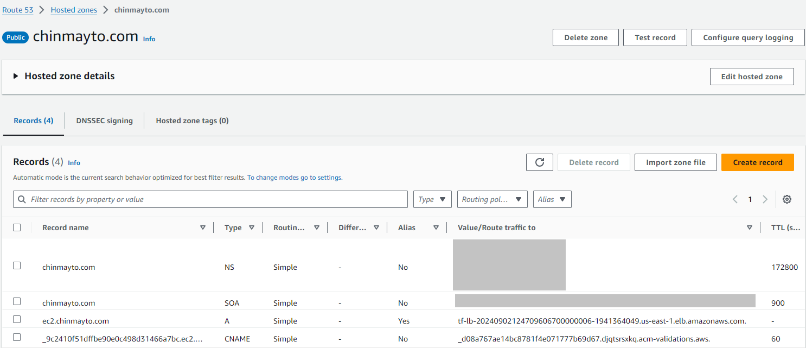

# Securing Your EC2 Website with HTTPS Using ACM Certs and Route 53 built with Terraform

In one of my earlier posts, we discussed designing a website hosted on EC2 instances within a Multi-AZ environment behind an application load balancer. The website, however, was not secured and was using HTTP over port 80. In this post, I will focus on securing the existing website by enabling HTTPS using SSL certificates from AWS Certificate Manager (ACM). You will need a domain for this purpose, and I used Route 53 to purchase mine.

# Architecture
Before we get started, let's take a quick look at the architecture we'll be working with:


# Step 1: Creating the VPC and Network Components
Lets start by creating a Virtual Private Cloud (VPC) with two public subnets to host NAT gateways and two private subnets to host EC2 instances in different Availability Zones. Also add Internet Gateways, NAT Gateways and Route Tables to manage inbound and outbound traffic. Refer earlier post!

# Step 2: Creating Linux EC2 Web Server Instances in Separate AZs
Next, we launch 2 Linux EC2 instances, each in a different Availability Zone in private subnets hosting apache webserver. Ensure they are configured with the necessary security groups, allowing HTTP (port 80) and HTTPS (port 443) traffic. Refer earlier post!

# Step 3: Request an ACM Certificate
To enable HTTPS, you will need an SSL certificate. AWS Certificate Manager (ACM) provides free SSL certificates that can be used with AWS services like Elastic Load Balancing (ELB). 
```terraform
################################################################################
# Create ACM Certificate with suggested domain name
################################################################################
resource "aws_acm_certificate" "mycert_acm" {
  domain_name               = "ec2.${var.domain_name}"
  subject_alternative_names = ["*.ec2.${var.domain_name}"]

  validation_method = "DNS"

  lifecycle {
    create_before_destroy = true
  }
}
```

# Step 4: Create Route 53 DNS Record for Validation
After requesting the certificate, you’ll need to validate that you own the domain. ACM provides a CNAME record that you need to add to your domain’s DNS settings in Route 53. Once the CNAME record is added to Route 53, ACM will automatically validate the domain and can take a few minutes to complete. Once validated, certificate will be issued and ready to use.
```terraform
################################################################################
# Route53 resources to perform DNS auto validation
################################################################################
data "aws_route53_zone" "selected_zone" {
  name         = var.domain_name
  private_zone = false
}

resource "aws_route53_record" "cert_validation_record" {
  for_each = {
    for dvo in aws_acm_certificate.mycert_acm.domain_validation_options : dvo.domain_name => {
      name   = dvo.resource_record_name
      record = dvo.resource_record_value
      type   = dvo.resource_record_type
    }
  }

  allow_overwrite = true
  name            = each.value.name
  records         = [each.value.record]
  ttl             = 60
  type            = each.value.type
  zone_id         = data.aws_route53_zone.selected_zone.zone_id
}

################################################################################
# DNS valiadtion of Certificate
################################################################################
resource "aws_acm_certificate_validation" "cert_validation" {
  timeouts {
    create = "5m"
  }
  certificate_arn         = aws_acm_certificate.mycert_acm.arn
  validation_record_fqdns = [for record in aws_route53_record.cert_validation_record : record.fqdn]
}
```

# Step 5: Creating an Application Load Balancer with HTTPS Listener
Next we create an Application Load Balancer (ALB) to support HTTPS. Add a new listener for HTTPS on port 443 and attach the ACM certificate to it. You can also configure redirection from HTTP to HTTPS, ensuring all traffic is securely encrypted. We add an A record in Route53 to route requests sent to domain name to ALB.


```terraform
################################################################################
# Define the security group for the Load Balancer
################################################################################
resource "aws_security_group" "aws-sg-load-balancer" {
  description = "Allow incoming connections for load balancer"
  vpc_id      = var.vpc_id
  ingress {
    from_port   = 443
    to_port     = 443
    protocol    = "tcp"
    cidr_blocks = ["0.0.0.0/0"]
    description = "Allow incoming HTTP connections"
  }
  egress {
    from_port   = 0
    to_port     = 0
    protocol    = "-1"
    cidr_blocks = ["0.0.0.0/0"]
  }

  tags = merge(var.common_tags, {
    Name = "${var.naming_prefix}-sg-alb"
  })
}

################################################################################
# Create application load balancer
################################################################################
resource "aws_lb" "aws-application_load_balancer" {
  internal           = false
  load_balancer_type = "application"
  security_groups    = [aws_security_group.aws-sg-load-balancer.id]
  //subnets                    = [var.public_subnets[0],var.public_subnets[1] ,var.public_subnets[2],var.public_subnets[3]]
  subnets                    = tolist(var.public_subnets)
  enable_deletion_protection = false

  tags = merge(var.common_tags, {
    Name = "${var.naming_prefix}-alb"
  })
}
################################################################################
# create target group for ALB
################################################################################
resource "aws_lb_target_group" "alb_target_group" {
  target_type = "instance"
  port        = 80
  protocol    = "HTTP"
  vpc_id      = var.vpc_id

  health_check {
    enabled             = true
    interval            = 60
    path                = "/"
    timeout             = 60
    matcher             = 200
    healthy_threshold   = 5
    unhealthy_threshold = 5
  }

  lifecycle {
    create_before_destroy = true
  }

  tags = merge(var.common_tags, {
    Name = "${var.naming_prefix}-alb-tg"
  })
}

################################################################################
# create a listener on port 80 with redirect action
################################################################################
resource "aws_lb_listener" "alb_http_listener" {
  load_balancer_arn = aws_lb.aws-application_load_balancer.id
  port              = 443
  protocol          = "HTTPS"

  certificate_arn = aws_acm_certificate_validation.cert_validation.certificate_arn

  default_action {
    type             = "forward"
    target_group_arn = aws_lb_target_group.alb_target_group.id
  }
}

################################################################################
# Target Group Attachment with Instance
################################################################################
resource "aws_alb_target_group_attachment" "tgattachment" {
  count            = length(var.instance_ids)
  target_group_arn = aws_lb_target_group.alb_target_group.arn
  target_id        = element(var.instance_ids, count.index)
}

################################################################################
# Create Route53 Record
################################################################################
resource "aws_route53_record" "route53_A_record" {
  zone_id = data.aws_route53_zone.selected_zone.zone_id
  name    = "ec2.${var.domain_name}"
  type    = "A"
  alias {
    name                   = aws_lb.aws-application_load_balancer.dns_name
    zone_id                = aws_lb.aws-application_load_balancer.zone_id
    evaluate_target_health = true
  }
}

```


# Steps to Run Terraform
Follow these steps to execute the Terraform configuration:
```terraform
terraform init
terraform plan 
terraform apply -auto-approve
```
Upon successful completion, Terraform will provide relevant outputs.
``` terraform
Apply complete! Resources: 31 added, 0 changed, 0 destroyed.
```

# Testing

AWS Certificate Manager showing DNS validated Cert for specified Domain


Route 53 Hosted Zone with CNAME and A records


Load Balancer with HTTPS 443 Listener Rule with SSL/TLS Certificate


Website accessed using domain name


Website showing its secure connection


Certificate Details


# Cleanup
Remember to stop AWS components to avoid large bills.
```terraform
terraform destroy -auto-approve
```
# Conclusion
Securing a website with HTTPS not only improves security and AWS makes it relatively easy to set up SSL certificates and manage them through ACM. By following the steps outlined above, you can secure your existing website hosted on EC2 instances behind an Application Load Balancer. 

# Resources
GitHub Repo: https://github.com/chinmayto/terraform-aws-linux-https-webserver-ec2-alb

Earlier Post: https://dev.to/chinmay13/placing-ec2-webserver-instances-in-a-private-subnet-with-internet-access-via-nat-gateway-using-terraform-167n
